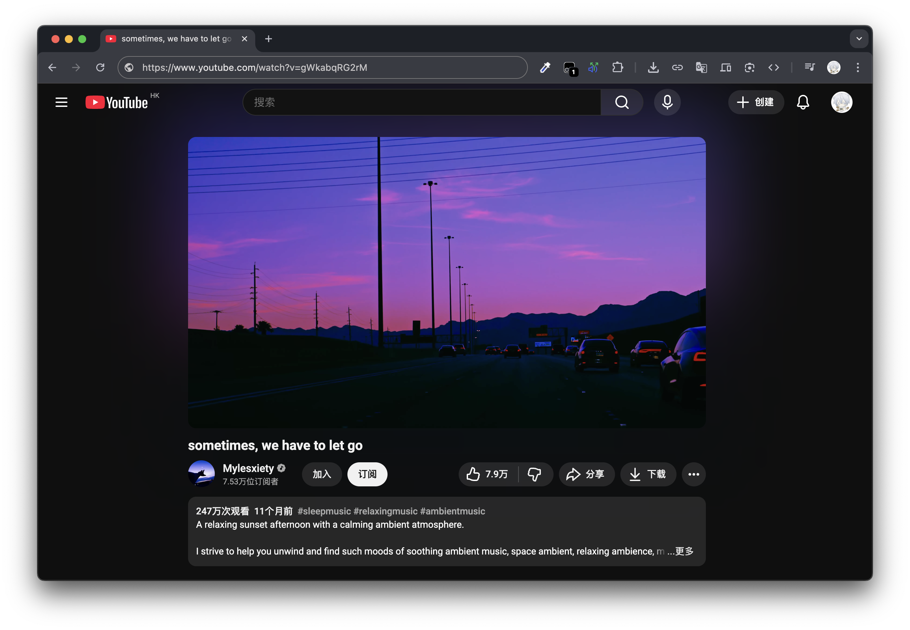

  <h1>YouTube Immersive Player</h1>

  
<strong><a href="README.md">English</a></strong> · <strong><a href="README.zh-CN.md">简体中文</a></strong> · <strong><a href="README.zh-TW.md">繁體中文</a></strong> · <strong><a href="README.ja.md">日本語</a></strong>

  
   
  <em>YouTube の UI ノイズを減らし、コンテンツに集中できるようにする設定可能なユーザースクリプトです。</em>

  

### 特長

- メイン動画を**中央配置**、フェードイン表示  
- レイアウトのガタつきや視覚的ノイズを抑制  
- **右側ドロワー**におすすめ動画を隠す 
- **V キー**で右ドロワーを切り替え 
- 動画を**中クリック**してドロワーを切り替え 
- ユーザースクリプト内の設定で簡単に機能をオン/オフ

### プライバシー

正常に動作させるには、ユーザースクリプト拡張で **Developer Mode（開発者モード）** を有効にしてください。  
本スクリプトはブラウザ上でローカルに動作し、**ネットワークリクエスト、トラッキング、データ収集は一切行いません**。

 

---

 

# インストール

すでにユーザースクリプトを**利用している**場合は、  
**[こちらのリンクからスクリプトをインストール](https://raw.githubusercontent.com/AsterHours/youtube-immersive-player/main/youtube-immersive-player.user.js)** してください。

> インストール後、**[任意の YouTube 動画ページ](https://www.youtube.com/watch?v=az0J8O8wRU8)** を開き、**V** を押してください。  
> 既定の視聴ページでは、動画を**中クリック**してドロワーを切り替えることもできます。  
> <mark>縦長レイアウト</mark> を除き、基本的に動作します。

それ以外の場合は、お使いのブラウザに応じて以下の手順に従ってください。

  

### A) Chromium ベースのブラウザ  
（Chrome / Edge / Brave / Opera / Vivaldi）

> まず **[Tampermonkey](https://www.tampermonkey.net/)** をインストールしてください。  
> 一般的には **[Chrome Web Store の Tampermonkey](https://chromewebstore.google.com/detail/tampermonkey/dhdgffkkebhmkfjojejmpbldmpobfkfo)** から入手できます。

1. **拡張機能ページを開く**  
   - 右上の **その他（三点） → 拡張機能 → 拡張機能を管理**。
2. **Tampermonkey → 詳細（Details）を開く**  
   - Chrome ユーザーは次のリンクを直接開けます：**[chrome://extensions/?id=dhdgffkkebhmkfjojejmpbldmpobfkfo](chrome://extensions/?id=dhdgffkkebhmkfjojejmpbldmpobfkfo)**  
   > GitHub から内部リンクが開かない場合は、**アドレスバーにコピー＆ペースト**してください。
3. **“Developer Mode” をオン**（拡張機能ページ右上あたり）
4. **すべてのサイトでユーザースクリプトを許可**（Tampermonkey の詳細ページ）：  
   - **Site access** → **On all sites**  
   - *(任意)* **Allow in Incognito** を有効化するとシークレットウィンドウでも動作
5. **[このリンクからスクリプトをインストール](https://raw.githubusercontent.com/AsterHours/youtube-immersive-player/main/youtube-immersive-player.user.js)** し、Tampermonkey で確認します。

  

### B) 🦊 Firefox

> まず **[Tampermonkey](https://www.tampermonkey.net/)** をインストールしてください。  
> **[Firefox アドオンの Tampermonkey](https://addons.mozilla.org/firefox/addon/tampermonkey/)** から入手できます。

1. **アドオンマネージャー** → **拡張機能**：**[about:addons](about:addons)** → **Tampermonkey** → **Permissions**  
   - **すべての Web サイトのデータにアクセス**できることを確認（既定）  
   - *(任意)* **Run in Private Windows** を有効化するとプライベートウィンドウでも動作
2. **[このリンクからスクリプトをインストール](https://raw.githubusercontent.com/AsterHours/youtube-immersive-player/main/youtube-immersive-player.user.js)** し、Tampermonkey で確認します。

  

### C)  macOS / iOS の Safari

> まず **[Tampermonkey](https://www.tampermonkey.net/)**（または他のユーザースクリプトマネージャ）をインストールしてください。  
> **[App Store の Tampermonkey](https://apps.apple.com/us/app/tampermonkey/id6738342400)** から入手できます。

1. **macOS Safari：** Safari → **設定** → **機能拡張** → **Tampermonkey** を有効化  
   - Tampermonkey → **Web サイトを編集（Edit Websites）** → **すべての Web サイト**を許可（あるいは **[YouTube](https://www.youtube.com/)** を追加）  
   - *(任意)* **プライベートブラウズ**での許可を有効化  
2. **iOS/iPadOS Safari：** 設定アプリ → **Safari** → **機能拡張** → **Tampermonkey** を有効化し、Web サイトアクセスを許可  
3. **[このリンクからスクリプトをインストール](https://raw.githubusercontent.com/AsterHours/youtube-immersive-player/main/youtube-immersive-player.user.js)** し、Tampermonkey で確認します。

   

---

 

### 設定
- [Releases](https://github.com/AsterHours/youtube-immersive-player/releases) を参照

### 互換性

- **デスクトップブラウザ + Tampermonkey**
- Chrome でテスト済み。他のモダンブラウザでも動作する見込みです。
- **横向きのみ動作**  
- 縦長レイアウトは**対象外**  
- 全画面での「上方向スワイプ」は **YouTube のネイティブ機能**（本スクリプトの動作ではありません）

### リンク

- プロジェクト：**[GitHub Repository](https://github.com/AsterHours/youtube-immersive-player)**  
- 作者：**[aste](https://github.com/AsterHours)**  
- **[YouTube](https://www.youtube.com/)**  
- **[Tampermonkey](https://www.tampermonkey.net/)**

 

## ライセンス

YouTube Immersive Player 

Copyright © 2025 AsterHours

This project is licensed under the Apache License, Version 2.0. 

See the LICENSE file for details. 
