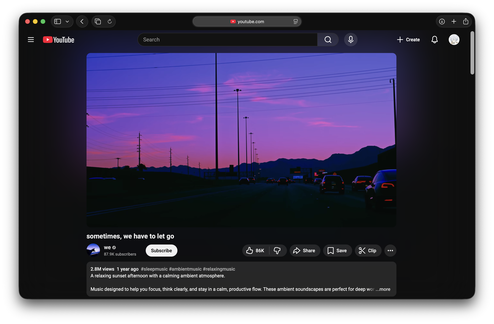

  <h1>YouTube 沉浸式播放器</h1>

  
<strong><a href="README.md">English</a></strong> · <strong><a href="README.zh-CN.md">简体中文</a></strong> · <strong><a href="README.zh-TW.md">繁體中文</a></strong> · <strong><a href="README.ja.md">日本語</a></strong>

  
   
  <em>一個可配置的使用者腳本，減少 YouTube 介面干擾，幫你專注於內容。</em>

  

### 功能

- 主影片**置中**，並有淡入效果  
- 避免版面抖動與視覺雜訊  
- 在**右側抽屜**隱藏推薦影片  
- 於預設觀看頁與全螢幕模式：**按下 V** 切換右側抽屜  
- 於預設觀看頁：**滑鼠中鍵點擊影片**可切換抽屜  
- 在使用者腳本中可**輕鬆切換**各項功能

### 隱私

為正常運作，你需要在使用者腳本擴充功能中啟用 **Developer Mode（開發者模式）**。  
腳本僅在你的瀏覽器本機執行，**沒有任何網路請求、追蹤或資料收集**。

 

---

 

# 安裝

如果你**已經在用**使用者腳本，  
**[點此直接安裝腳本](https://raw.githubusercontent.com/AsterHours/youtube-immersive-player/main/youtube-immersive-player.user.js)**。

> 安裝後，**[前往任一 YouTube 影片](https://www.youtube.com/watch?v=az0J8O8wRU8)** 並按 **V**。  
> 在預設觀看頁，你也可以**中鍵點擊影片**來切換抽屜。  
> 除了 <mark>影院模式（theater mode）與直向版面（portrait layouts）</mark> 外皆可正常運作。

否則，請依你的瀏覽器按以下步驟：

  

### A) Chromium 系列瀏覽器  
（Chrome / Edge / Brave / Opera / Vivaldi）

> 請先安裝 **[Tampermonkey](https://www.tampermonkey.net/)**。  
> 通常可透過 **[Chrome 線上應用程式商店的 Tampermonkey](https://chromewebstore.google.com/detail/tampermonkey/dhdgffkkebhmkfjojejmpbldmpobfkfo)** 取得。

1. **開啟擴充功能頁面**  
   - 右上角 **更多（三點） → 擴充功能 → 管理擴充功能**。
2. **找到 Tampermonkey → 詳細資料（Details）**  
   - Chrome 使用者可直接造訪：**[chrome://extensions/?id=dhdgffkkebhmkfjojejmpbldmpobfkfo](chrome://extensions/?id=dhdgffkkebhmkfjojejmpbldmpobfkfo)**  
   > 若在 GitHub 點內部連結無效，請**複製並貼上到位址列**。
3. **開啟 “Developer Mode”**（通常在擴充頁右上角）。
4. **允許在所有網站執行使用者腳本**（Tampermonkey 詳細資料頁）：  
   - **Site access** → **On all sites**  
   - *(可選)* 如需在無痕視窗使用，請開啟 **Allow in Incognito**
5. **[開啟此連結安裝腳本](https://raw.githubusercontent.com/AsterHours/youtube-immersive-player/main/youtube-immersive-player.user.js)** 並在 Tampermonkey 中確認。

  

### B) 🦊 Firefox

> 請先安裝 **[Tampermonkey](https://www.tampermonkey.net/)**。  
> 可從 **[Firefox 附加元件商店的 Tampermonkey](https://addons.mozilla.org/firefox/addon/tampermonkey/)** 取得。

1. 開啟 **附加元件管理器** → **擴充套件**：**[about:addons](about:addons)** → **Tampermonkey** → **權限（Permissions）**  
   - 確認其可**存取所有網站的資料**（預設）  
   - *(可選)* 需要在私密視窗使用時，開啟 **Run in Private Windows**
2. **[開啟此連結安裝腳本](https://raw.githubusercontent.com/AsterHours/youtube-immersive-player/main/youtube-immersive-player.user.js)** 並在 Tampermonkey 中確認。

  

### C)  macOS / iOS 的 Safari

> 請先安裝 **[Tampermonkey](https://www.tampermonkey.net/)**（或其他使用者腳本管理器）。  
> 可從 **[App Store 的 Tampermonkey](https://apps.apple.com/us/app/tampermonkey/id6738342400)** 取得。

1. **macOS Safari：** Safari → **設定** → **擴充功能** → 啟用 **Tampermonkey**  
   - 點擊 Tampermonkey → **編輯網站** → 允許 **所有網站**（或加入 **[YouTube](https://www.youtube.com/)**）  
   - *(可選)* 需要在私密瀏覽使用時，開啟相應權限  
2. **iOS/iPadOS Safari：** 設定 app → **Safari** → **擴充功能** → 啟用 **Tampermonkey** 並允許網站存取  
3. **[開啟此連結安裝腳本](https://raw.githubusercontent.com/AsterHours/youtube-immersive-player/main/youtube-immersive-player.user.js)** 並在 Tampermonkey 中確認。

   

---

 

### 更新日誌
- 請見 [Releases](https://github.com/AsterHours/youtube-immersive-player/releases)

### 相容性

- **桌面瀏覽器 + Tampermonkey**
- 已在 Chrome 測試；其他現代瀏覽器通常也可使用。
- **僅支援橫向、非影院模式**  
- 影院模式與直向版面**不在腳本支援範圍**  
- 全螢幕的「上滑」是 **YouTube 原生行為**（非腳本功能）

### 連結

- 專案首頁：**[GitHub Repository](https://github.com/AsterHours/youtube-immersive-player)**  
- 作者：**[Aster](https://github.com/AsterHours)**  
- **[YouTube](https://www.youtube.com/)**  
- **[Tampermonkey](https://www.tampermonkey.net/)**

 

## 授權

MIT © Aster Hours
